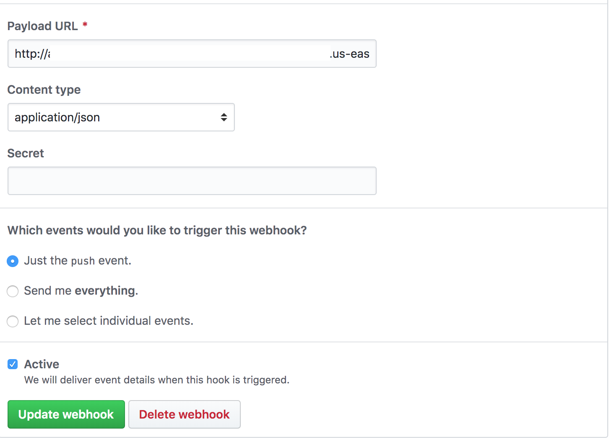

# Getting started with Triggers

To get started with Triggers, lets put it to work building and deploying a real image. In the following guide we will use `Triggers` to handle a real Github webhook request to kickoff a PipelineRun.

## Install dependencies

Before we can use the Triggers project, we need to get some dependencies out of the way.

  - [A Kubernetes Cluster](https://kubernetes.io/docs/setup/)
    - For our purposes any publicly available k8s cluster will do, as long as it can produce a Service Loadbalancer.
  - [Install Tekton Pipelines](https://github.com/tektoncd/pipeline/blob/master/docs/install.md#installing-tekton-pipelines)
    - Pipelines is the backbone of Tekton and will allow us to accomplish the work we plan to do.
  - [Install Triggers](https://github.com/tektoncd/triggers/blob/master/DEVELOPMENT.md#install-triggers)
    - Of course we need to install our project as well, so we can accept and process events into PipelineRuns!
  - Pick a Github repo with a Dockerfile as your build object (or you can fork [this one](https://github.com/iancoffey/ulmaceae)).
    - Clone this repo locally -  we will come back to this repo later.
## Configure the cluster

Now that we have our cluster ready, we need to setup our getting-started namespace and RBAC. We will keep everything inside this single namespace for easy cleanup. In the unlikely event that you get stuck/flummoxed, the best course of action might be to just delete this namespace and start fresh.

- Create the *getting-started* namespace, where all our resources will live:
  - `kubectl create namespace getting-started`
- [Create the admin user, role and rolebinding](./rbac/admin-role.yaml)
  - `kubectl apply -f ./docs/getting-started/rbac/admin-role.yaml`
- [Create the create-webhook user, role and rolebinding](./rbac/webhook-role.yaml)
  - `kubectl apply -f ./docs/getting-started/rbac/webhook-role.yaml`
  - This will allow our webhook to create the things it needs to.

## Install the Pipeline and Triggers

Now we have to install the Pipeline we plan to use and also our Triggers resources.

Our Pipeline will do a few things:
- Retrieve the source code
- Build and push the source code into a docker image
- Push the image to the specified repository
- Run the image locally

- [Install the Pipeline](./pipeline.yaml)
  - The Pipeline will build a docker image with img and deploy it locally via kubectl image.
  - `kubectl apply -f ./docs/getting-started/pipeline.yaml`

Our Triggers project will pickup from there:
- We will setup an EventListener to accept and process Github Push events
- A TriggerTemplate to create templates Resources and PipelineRun per event received.

- [Install the TriggerTemplate, TriggerBinding and EventListener](./triggers.yaml)
  -  First, **edit** the `triggers.yaml` file to reflect
    - The Docker repository to push the image blob
      - You will the `DOCKERREPO-REPLACEME` string everywhere it is needed.
  - Once you have updated the triggers file, you can apply it!
  - `kubectl apply -f ./docs/getting-started/triggers.yaml`
  - If that succeeded, your cluster is ready to start handling Events.

## Configure Github Webhook

Now we need some events to work with. We need to configure Github to send events to our Cluster, which is quick but has a few tricky parts.

- Establish your inbound EXTERNAL-URL hostname:
  - In order to accept Github webhook payloads, our listener must be reachable from the internet.
  - Our EventListener will create a [Loadbalancer Service](https://kubernetes.io/docs/concepts/services-networking/service/#loadbalancer) for us, so we just need to determine its hostname. How the loadbalancer gets created will depend on how you are deploying this getting-started - AWS will behave differently than GCP, and so on.
  - Inspect the output of `k get service/getting-started-listener -n getting-started -o yaml` - there should be a hostname associated with the ingress now.
  - This command should retrieve your hostname: `k get service/getting-started-listener -n getting-started -o json | jq ".status.loadBalancer.ingress[0].hostname"`

Now configure Github webhooks to send *push* events to your clusters Loadbalancer ingress hostname.

### Github Webhook Process

Login to [Github](https://github.com) and configure your webhooks under the Repository settings. You can use the following images to see how this should look:

Make sure to set `push` events as the type of events you want to send - push is the default.

## Watch it work!

- Commit and push an empty commit to your development repo:
  - `git commit -a -m"build commit" --allow-empty && git push origin mybranch`
- Now, you can follow the Task output in `kubectl logs`:
  - First the image builder task:
    - `kubectl logs -l somelabel=somekey --all-containers`
  - Then our deployer task:
    - `k logs -l tekton.dev/pipeline=getting-started-pipeline -n getting-started --all-containers`
- We can see now that our CI system is working! Images pushed to this repo result in a running pod in our cluster.
  - We can examine our pod like so:
    - k logs tekton-triggers-built-me -n getting-started --all-containers

Now we can see our new image running our cluster, after having been retrieved, tested, vetted and built, docker pushed (and pulled) and finally ran on our cluster as a Pod.

## Clean up

- Delete the *getting-started* namespace!
  - `kubectl delete namespace getting-started`
